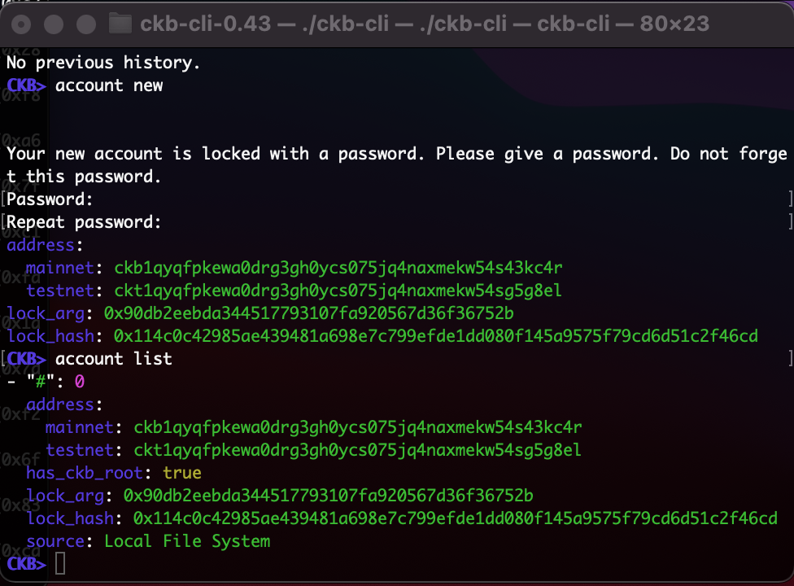

# Gitcoin: 1) Create A Godwoken Account On The EVM Layer 2 Testnet

Description : https://gitcoin.co/issue/nervosnetwork/grants/2/100026208

## 1. A screenshot of the accounts you created (account list) in ckb-cli.

## 2. A link to the Layer 1 address you funded on the Testnet Explorer.

[ckt1qyqfpkewa0drg3gh0ycs075jq4naxmekw54sg5g8el](https://explorer.nervos.org/aggron/address/ckt1qyqfpkewa0drg3gh0ycs075jq4naxmekw54sg5g8el)

## 3. A screenshot of the console output immediately after you have successfully submitted a deposit to Layer 2.

TODO

