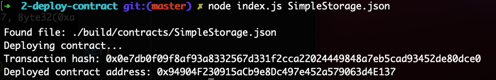

# Gitcoin: 2) Deploy A Simple Ethereum Smart Contract On Polyjuice

Description : https://gitcoin.co/issue/nervosnetwork/grants/3/100026209

## 1. A screenshot of the console output immediately after you have successfully deployed a smart contract.

## 2. The transaction hash from the contract deployment (in text format).

Transaction hash: 0x0e7db0f09f8af93a8332567d331f2cca22024449848a7eb5cad93452de80dce0

## 3. The deployed contract address from the contract deployment (in text format).

Deployed contract address: 0x94904F230915aCb9e8Dc497e452a579063d4E137
