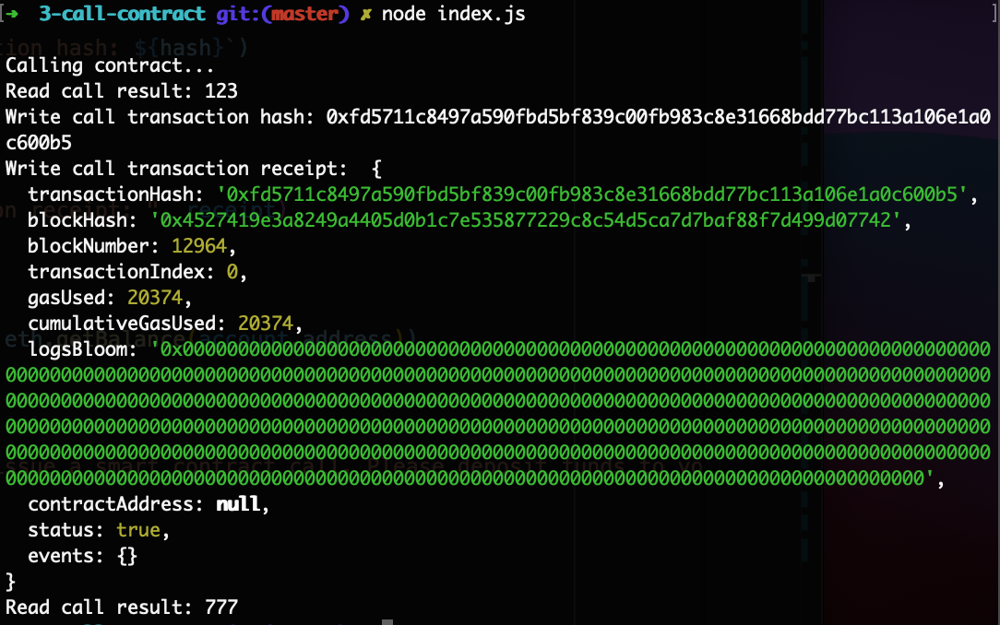

# Gitcoin: 3) Issue A Smart Contract Call To The Deployed Smart Contract

Description : https://gitcoin.co/issue/nervosnetwork/grants/4/100026210

## 1. A screenshot of the console output immediately after you have successfully issued a smart contract call.



## 2. The transaction hash from the console output (in text format).

Transaction hash: 0xfd5711c8497a590fbd5bf839c00fb983c8e31668bdd77bc113a106e1a0c600b5

```sh
0xfd5711c8497a590fbd5bf839c00fb983c8e31668bdd77bc113a106e1a0c600b5
```

## 3. The contract address that you called (in text format).

Deployed contract address: 0x94904F230915aCb9e8Dc497e452a579063d4E137

```sh
0x94904F230915aCb9e8Dc497e452a579063d4E137
```

## 4. The ABI for contract you made a call on (in text format).

```sh
[
  {
    inputs: [],
    stateMutability: "payable",
    type: "constructor"
  },
  {
    inputs: [
      {
        internalType: "uint256",
        name: "x",
        type: "uint256"
      }
    ],
    name: "set",
    outputs: [],
    stateMutability: "payable",
    type: "function"
  },
  {
    inputs: [],
    name: "get",
    outputs: [
      {
        internalType: "uint256",
        name: "",
        type: "uint256"
      }
    ],
    stateMutability: "view",
    type: "function"
  }
]
```
