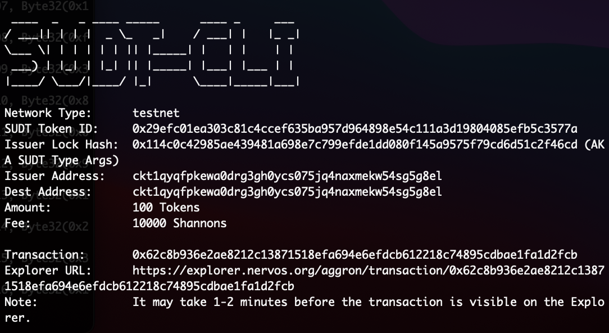
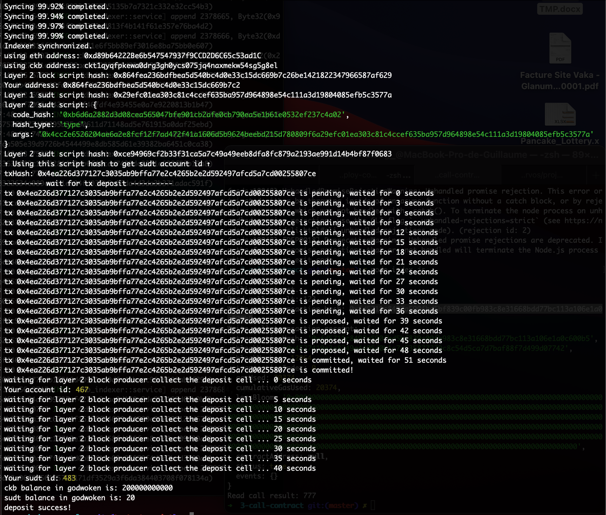

# Gitcoin: 4) Issue An SUDT Token On Layer 1 And Deposit It To Layer 2

Description : https://gitcoin.co/issue/nervosnetwork/grants/5/100026211

## 1. A link to the Layer 1 address you funded on the Testnet Explorer.

[ckt1qyqfpkewa0drg3gh0ycs075jq4naxmekw54sg5g8el](https://explorer.nervos.org/aggron/address/ckt1qyqfpkewa0drg3gh0ycs075jq4naxmekw54sg5g8el)

## 2. A screenshot of the console output immediately after using sudt-cli to create your SUDT tokens on Layer 1.



## 3. A link to the transaction ID created by sudt-cli on the Testnet Explorer.

[0x62c8b936e2ae8212c13871518efa694e6efdcb612218c74895cdbae1fa1d2fcb](https://explorer.nervos.org/aggron/transaction/0x62c8b936e2ae8212c13871518efa694e6efdcb612218c74895cdbae1fa1d2fcb)

```sh
https://explorer.nervos.org/aggron/transaction/0x62c8b936e2ae8212c13871518efa694e6efdcb612218c74895cdbae1fa1d2fcb
```

## 4. A screenshot of the console output immediately after you have successfully submitted a deposit to Layer 2 using the account-cli tool.



## 5. The SUDT ID from the console output after executing the deposit script.

```sh
Your sudt id: 483
```
