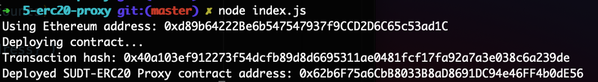
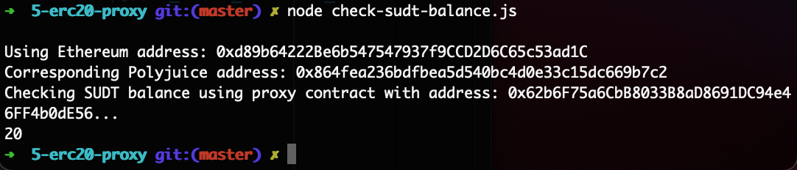

# Gitcoin: 5) Deploy The ERC20 Proxy Contract For The Deposited SUDT

Description : https://gitcoin.co/issue/nervosnetwork/grants/6/100026212

## 1. A screenshot of the console output immediately after deploying smart contract.



## 2. The address of the ERC20 Proxy Contract you deployed.

```sh
Deployed SUDT-ERC20 Proxy contract address: 0x62b6F75a6CbB8033B8aD8691DC94e46FF4b0dE56
```

## 3. A screenshot of the console output immediately after checking your SUDT balance.



## 4. The Ethereum address that was checked.

```sh
Using Ethereum address: 0xd89b64222Be6b547547937f9CCD2D6C65c53ad1C
```
