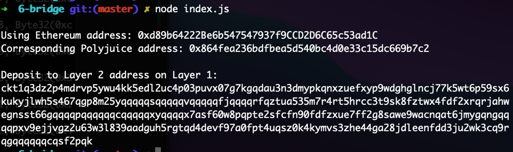

# Gitcoin: 6) Use Force Bridge To Deposit Tokens From Ethereum To Polyjuice

Description : https://gitcoin.co/issue/nervosnetwork/grants/7/100026213

## 1. A screenshot of the console output immediately after you have successfully generated your Deposit Receiver Address.



## 2. Your Deposit Receiver Address.

```sh
ckt1q3dz2p4mdrvp5ywu4kk5edl2uc4p03puvx07g7kgqdau3n3dmypkqnxzuefxyp9wdghglncj77k5wt6p59sx6kukyjlwh5s467qgp8m25yqqqqqsqqqqqvqqqqqfjqqqqrfqztua535m7r4rt5hrcc3t9sk8fztwx4fdf2xrqrjahwegnsst66gqqqqpqqqqqqcqqqqqxyqqqqx7asf60w8pqpte2sfcfn90fdfzxue7ff2g8sawe9wacnqat6jmygqngqqqqpxv9ejjvgz2u63w3l839aadguh5rgtqd4devf97a0fpt4uqsz0k4kymvs3zhe44ga28jdleenfdd3ju2wk3cq9rqgqqqqqqcqsf2pqk
```

## 3. The Ethereum address used to generate the Deposit Receiver Address.

```sh
Using Ethereum address: 0xd89b64222Be6b547547937f9CCD2D6C65c53ad1C
```

## 4. A link to the Etherscan explorer for the successful Force Bridge transaction. This can be found on Force Bridge under History→Succeed.

[https://rinkeby.etherscan.io/tx/0xef5462f811f6e6f411f08812903808ffa03bf545992ec1dcffeb5673ad3786a1](https://rinkeby.etherscan.io/tx/0xef5462f811f6e6f411f08812903808ffa03bf545992ec1dcffeb5673ad3786a1)

## 5. A link to the Nervos explorer for the successful Force bridge transaction. This can be found on Force Bridge under History→Succeed.

[https://explorer.nervos.org/aggron/transaction/0x3822e0438b5269294095776cbd8c43cbd8df20a216ca7c3035bcbb28dd914fb4](https://explorer.nervos.org/aggron/transaction/0x3822e0438b5269294095776cbd8c43cbd8df20a216ca7c3035bcbb28dd914fb4)
